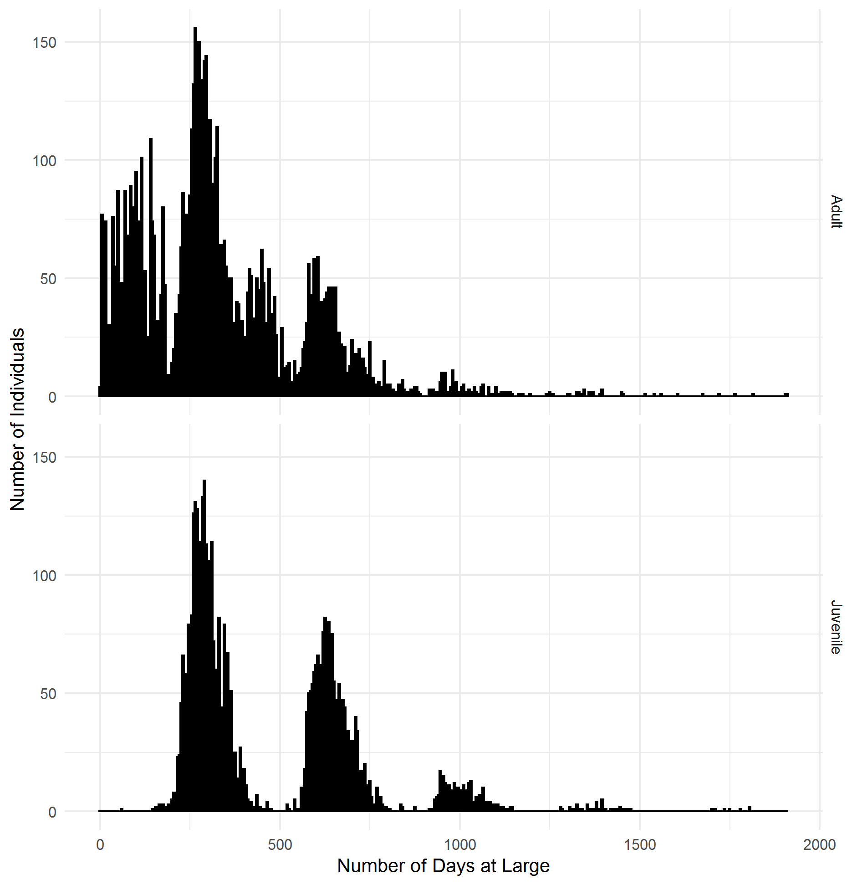

```{r import summary data, echo=FALSE, message=FALSE, warning=FALSE}
require(knitr)
require(kableExtra)
require(tidyverse)

course.eval <- read.csv("./data/tag.recapt.sum.csv")[1:16,]
names(course.eval) <- c("Year","Adult Tagged", "Juvenile Tagged",
                        "Adult Recaptured","Juvenile Recaptured",
                        "Adult % Recaptured",
                        "Juvenile % Recaptured")
```

## Introduction

A high priority research need for improving the assessment of Gulf Menhaden include understanding stock structure, individual growth dynamics, and improving estimates of natural mortality. One of the primary ways that mortality and growth can be understood is through tagging and recapture of individuals (Leaf et al. 2007, Leaf et al. 2008). Similarly, migration and stock delineation have also been described with such tagging studies. Because of the power of tag and recapture studies for understanding stock dynamics, the Gulf Menhaden Stock Assessment report further recommended replicating the tagging work performed by NOAA scientists, which were extensive: Pristas tagged 75,000 *B. patronus* from 1969 to 1972 and Ahrenholz tagged 237,000 *B. patronus* from 1970 to 1985. These studies involved tagging juveniles and adults with internal, individually-numbered ferro-magnetic tags that were recovered on magnets in fish reduction factories. Because of the costs of such studies, it is unlikely that such a large-scale tagging study will ever be performed again. However, leaps in the computational power and statistical modeling approaches in recent decades has made re-analysis of the previously collected data a very worthwhile endeavor. Currently, the data from these tagging studies reside as paper copies kept at the Southeast Fishery Science Center, Beaufort, NC and are not available for digital analysis.

The project started in 1969 (Table 1, 2). The scientists working on the project went out, a few days every couple of months to tag Gulf Menhaden. They used a small version of a purse seine to collect fish to tag. The tags were magnetic and sized appropriately to the length of the fish, "small" and "medium" sized. The smaller tags were used to tag juvenile fish and medium were used for adults. They inserted the tags into the abdominal cavity of each fish and released it. In order to get the tag recovery (or recapture) data, they depended on the menhaden processing companies. The tags were retrieved by sampling the processing conveyor belts which were equipped with magnets running along the top. 

## Methods

We partnered with NOAA scientist Dr. Amy Schueller at the SEFSC Beaufort Lab, who supported our efforts by providing hard copies of Dean Ahrenholz's tag-recapture data collected in the 1960's, 1970's, and 1980's. To perform exploratory analysis to understand the feasibility of a comprehensive reanalysis of the tag and recapture data (the overarching theme of the project) we:

1.) Acquired and cataloged existing data, 

2.) Digitized the data, 

3.) Performed quality assurance and quality control, and

4.) Evaluated the utility of the data by comparing the magnitude of tagged and recaptured fish and the data structure with those studies performed by Liljestrand et al.:

+ Liljestrand, E.M., M.J. Wilberg, and A.M. Schueller. 2019. Estimation of movement and mortality of Atlantic menhaden during 1966-1969 using a Bayesian multi-state mark-recovery model. Fisheries Research 210:204-213.

+ Liljestrand, E.M., M.J. Wilberg, and A.M. Schueller. 2019. Multi-state dead recovery mark-recovery model performance for estimating movement and mortality rates. Fisheries Research 210:214-223.  

## Results

### Acquired and cataloged existing data, digitize the data, perfrom quality assurance and quality control

K. Price traveled to Beaufort, NC in October of 2019 to sort through and obtain original data on Gulf Menhaden tag and recapture efforts from the 60s, 70s, and 80s. She and A. Schueller sorted through about 20 books (bound volumes of printed material) of data. Three primary sources of data were identified: 

#### 1. The tag and recapture histories of adult and juvenile individuals

These data are the record of individual fish captured (in the field) and recaptured (in a processing plant) over the course of the study. These data were scanned to .pdf files and then digitized and saved as Excel documents. 

##### The data are comprised of the following variables: 

+ Tag_Year, the year in which the menhaden were originally tagged.

+ Tag_Month, the month in which the menhaden were originally tagged.

+ Tag_Day, the day on which the menhaden were originally tagged. 

+ Tag_Series is denoted by the letter, this indicates the series of tags being deployed. 

+ Tag_Series_Number indicates which group in the tag series with which the Gulf Menhaden were tagged. Tag Series and Tag Series Number are paired. For each group of tags, with a tag series and number, (example: U20) has 100 individual tags and are numbered from 0 to 99. These specific tag IDs were entered under the Recov_Tag_ID column. 

+ Recov_Year, Recov_Month, and Recov_Day are the date that the individual Gulf Menhaden tags were recovered from the reduction plant.

+ Recov_Plant is the denoted by a number that has been assigned to each Gulf Menhaden reduction plant. This is the plant that individual fish were processed.

We evaluated this data to understand the magnitude of tag and recaptured individuals, by life-stage (Table 1, 2) and also the characteristics of tagged and recaptured fish.

#### 2. Magnet Efficiency Trials

From Liljestrand Master's Thesis: "Magnet efficiency experiments were conducted to test the efficiency of magnets for collecting tags by introducing batches of tagged Menhaden (usually 100 fish) directly into each reduction plant.". These data were conducted by the original experimenters and used by Liljestrand et al.  to determine the probability that a tagged fish would be observed, if it was collected.

##### The magnet efficiency data are comprised of the following variables: 

+ Test_Year, Test_Month, and Test_Day indicate the date on which the plant test was performed, meaning the date when the 100 random Gulf Menhaden were tagged to test accuracy of magnets.

+ Tag_Series_Number indicates which group in the tag series with which the Gulf Menhaden were tagged. or each group of tags, with a tag series and number, (example: U20) has 100 individual tags and are numbered from 0 to 99. These specific tag IDs were entered under the Recov_Tag_ID column. 

+ Recov_Year, Recov_Month, and Recov_Day pertain to the date on which the individual Gulf Menhaden tags were recovered from the test plant. 

+ Plant is the denoted by a number that has been assigned to each Gulf Menhaden reduction plant. This is the plant where the tests were performed.  

#### 3. The tag and recapture histories of adults with fork-length

A small and unique third source of data in the archived data was a subset of recapture data that included fork length of fish, upon collection by the plant. The tag and recapture component of the data was integrated into the tag and recapture histories of adult individuals. 

The utility of these data are limited for analysis of growth or to understand how cathability is influenced by the length of the fish. However, they are useful for indicating what the experimenters considered an "adult" fish length to be.

##### The variables associated with the tag and recapture histories of adults with fork-length

All of the variables are the same as the tag and recapture histories of adults, but include an additional column which is the fork length in FL (mm).


### Evaluation the utility of the data

#### Magnitude of mark and recapture data

In comparison to the magnitude of tagged and recaptured individuals used by Liljestrand et al., the data we have synthesized has fewer number of recaptures (Fig. 3, 4). However, the overall rate of recapture is generally high (Table 1 and 2) - fewer fish were tagged in the Gulf of Mexico, than in the mid-Atlantic. One difference in the modeling approach we proprose to use that contrasts that of Liljestrand et al. is that we will not estimate movement parameters - we don't have geographic movement parameters in these data. Ommitting these parameters in the modeling effort should improve the ability of the model to derive precise estimates of mortality.

Having positive rates of recapture (~3%) is a necessary characteristic of using mark and recapture models. Another aspect of the tag-recapture work, that is necessary for using contemporary models for parameter estimation, is to have recapture occurences at many sampling efforts. Figure 2 indicates that both life stages have times 'at large' of less than and greater than 500 days. 

#### Evaluation of observation error

Mark recapture modeling attempts to determine (at least) two related parameters - survival and probability of recapture. The second paramter (probability of recapture) is in part determined by observation error. The plant- and year-specific capture probability derived from the trial data, different plants have varying ability for tag detection. These modeled parameters, derived from the data, can be incorporated into the model, as Liljestrand et al. has done.

In conclusion, the magnitude of the data (number of recaptures, magnet trials) and its structure (varying times 'at large', stage specific tagging) are likely appropriate for modeling. I would recommend that this be attempted.


\pagebreak

Table 1. Summary of adult tag-recapture data from scanned and cataloged data.
```{r sampling.summary adult, echo=FALSE, message=FALSE, warning=FALSE}
require(knitr)
require(kableExtra)
require(tidyverse)

knitr::kable(course.eval[,c(1, 2, 4, 6)]) %>%
  kable_styling(bootstrap_options = "striped", full_width = FALSE, position = "center")
```

\pagebreak

Table 2. Summary of juvenile tag-recapture data from scanned and cataloged data.
```{r sampling.summary juvenile, echo=FALSE, message=FALSE, warning=FALSE}
require(knitr)
require(kableExtra)
require(tidyverse)

knitr::kable(course.eval[,c(1, 3, 5, 7)]) %>%
  kable_styling(bootstrap_options = "striped", full_width = FALSE, position = "center")
```

\pagebreak

Table 3. Summary of juvenile tag-recapture data with fork length information.
```{r summary table FL, echo=FALSE, message=FALSE, warning=FALSE}
require(knitr)
require(kableExtra)
require(tidyverse)

course.eval <- readxl::read_excel("./Tag_Recapture_Data/Adult_Field_Data_Length_1969.xlsx")
course.eval <- course.eval %>% 
  dplyr::filter(Fork_Length <= 400) %>% 
    dplyr::filter(Fork_Length >= 100) %>% 
  group_by(Tag_Month) %>% 
  summarise('Number of Recaptured Fish' = length(Tag_Year), 
            'Mimimum Length' = min(Fork_Length, na.rm = T),
            'Maximum Length' = max(Fork_Length, na.rm = T))

knitr::kable(course.eval)

```

\pagebreak


\pagebreak



\pagebreak


\pagebreak

